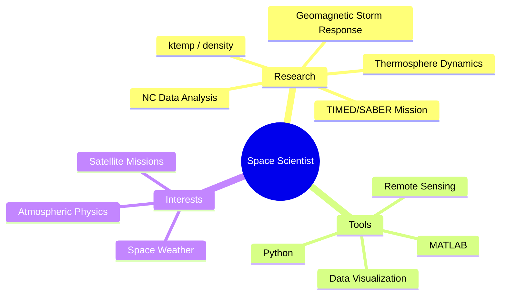

<!-- 顶部波浪装饰 -->

<!-- 打字机效果 -->

<!-- 访客计数器 + 连续打卡 -->

  
  

### 🐍 Contribution Snake

---

<!-- 史诗叙事海报 - 主视觉 -->

# 🌌 XiaoSi | Space Atmosphere Researcher

### *Exploring the Upper Atmosphere. Decoding the Stars.*

---

<!-- 社交链接与科研徽章 -->

---

<!-- 关于我 -->
### 🛰️ About Me

---

<!-- GitHub 统计 -->

### 📊 GitHub Stats

---

<!-- 技术栈 -->

### 🛠️ Tech Stack

**Languages**

**Tools & Frameworks**

**Research Domain**

---

<!-- 科研笑话 -->

### 😄 Research Humor

---

<!-- 底部波浪装饰 -->

### ✨ "The cosmos is within us. We are made of star-stuff."

*— Carl Sagan*

