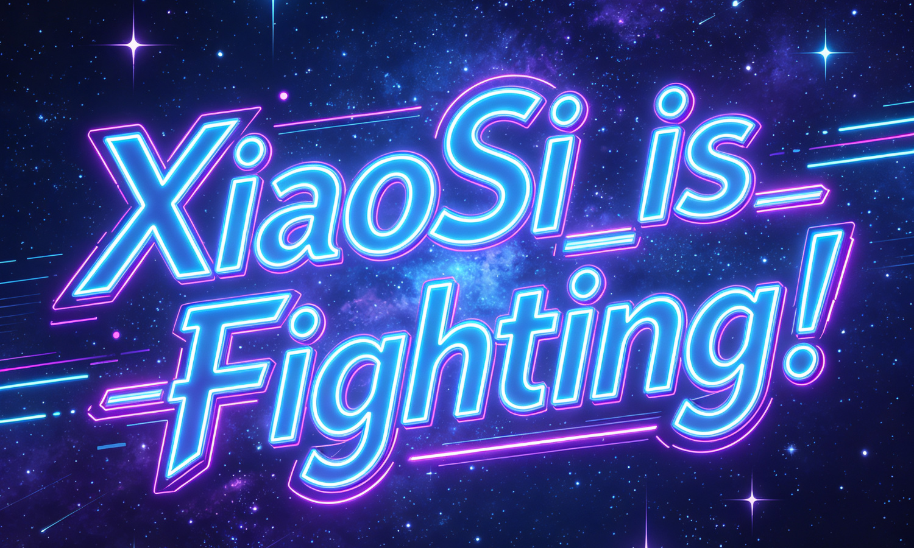

<!-- 多语言名言 - 第一眼中文 -->
<p align="center">
    <br>
    
    <br>
    <font size="5"><b><i>—— Si</i></b></font>
    <br><br>
</p>

---

<!-- 贪吃蛇（移到名言下面） -->
## 🐍 Contribution Snake

<p align="center">
    
</p>

---

<!-- 顶部状态徽章 -->
<p align="center">
    <a href="https://github.com/siyunhao2025-beep/siyunhao2025-beep"></a>
    <a href="https://github.com/siyunhao2025-beep/siyunhao2025-beep"></a>
    <a href="https://github.com/siyunhao2025-beep/siyunhao2025-beep/graphs/contributors"></a>
    <a href="https://github.com/siyunhao2025-beep/siyunhao2025-beep/stargazers"></a>
    
</p>

<!-- 赛博朋克横版 banner -->
<p align="center">
    
</p>

---

<!-- 研究世界海报 -->
## 🖼️ My Research World

<p align="center">
    
</p>

---

<!-- 打字机效果 - 个人介绍（移到海报后面） -->
<p align="center">
    <a href="https://git.io/typing-svg"></a>
</p>

---

<!-- 技能表格（移到海报后面） -->
## 🛠️ My Research Toolkit

| Category | Tools |
|----------|-------|
| <font size="4">**Languages**</font> |    |
| <font size="4">**Data Processing**</font> |    |
| <font size="4">**Visualization**</font> |   |
| <font size="4">**Research Domain**</font> |    |
| <font size="4">**Essential**</font> |  |

---

<!-- About Me（移到海报后面） -->
## 📝 About Me

<p align="center">

```
👋 Name:   XiaoSi
🎓 Field:  Thermospheric Dynamics | Geomagnetic Storm Response
🛰️ Data:   TIMED/SABER (ktemp / density, NC format)
🔧 Tools:  MATLAB + Python + unlimited coffee
⏰ Status: 2 AM, version 7 of the plot
```

</p>

<p align="center">
    <font size="4">💬 Advisor replied with four words: <b><i>"Sleep on it later."</i></b></font>
</p>

---

<!-- 连续打卡（移到海报后面） -->
## 🔥 GitHub Streak

<p align="center">
    
</p>

---

<!-- 底部波浪 -->
<p align="center">
    
</p>