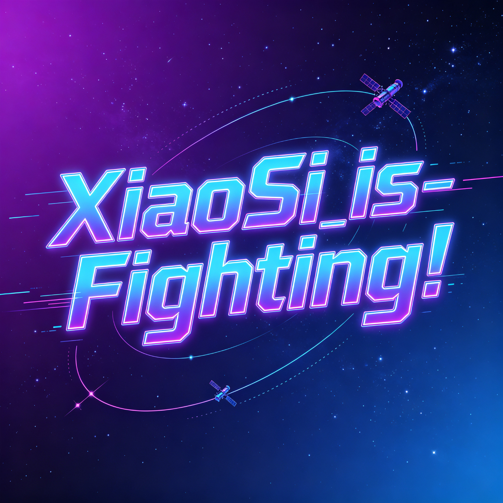

<div align="center">

<!-- 赛博朋克艺术字标题 -->


### 🛰️ 空间大气物理研究者 | TIMED/SABER 卫星数据


</div>

---

## 🐍 我的贡献小蛇

<div align="center">


</div>

---

## 🖼️ 我的研究世界

<div align="center">


</div>

---

## 📝 关于我

```
👋 名字: XiaoSi
🎓 方向: 热层大气动力学 | 地磁暴响应
🛰️ 数据: TIMED/SABER (ktemp / density)
🔧 工具: MATLAB + Python + 无尽的咖啡
⏰ 状态: 凌晨两点，第 7 版
```

> 💬 导师回了四个字：「待会儿睡」

---

## 🛠️ 我用的家伙事儿

<div align="center">

**编程语言**


**数据工具**


**科研装备**


</div>

---

## 📊 我的 GitHub 生活

<div align="center">


<br>


</div>

---

## 😄 科研人日常

<div align="center">


</div>

---

<div align="center">


### ✨ "We are made of star-stuff."

*— Carl Sagan*

</div>